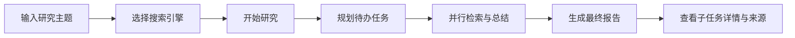
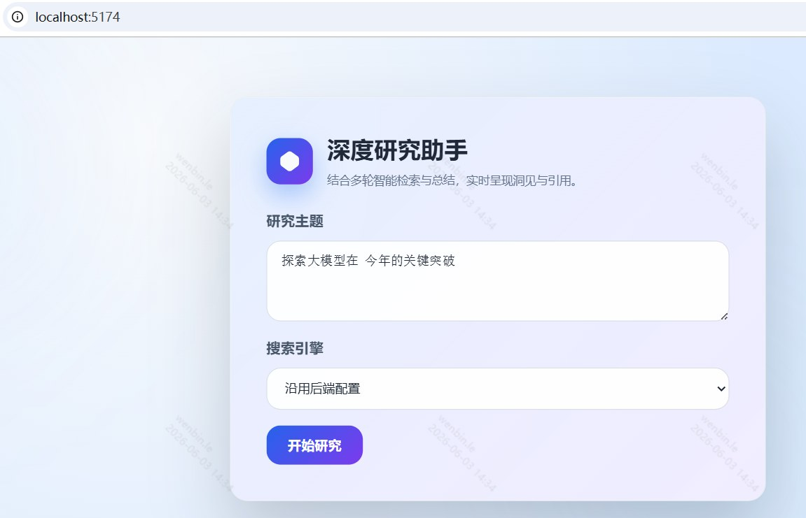
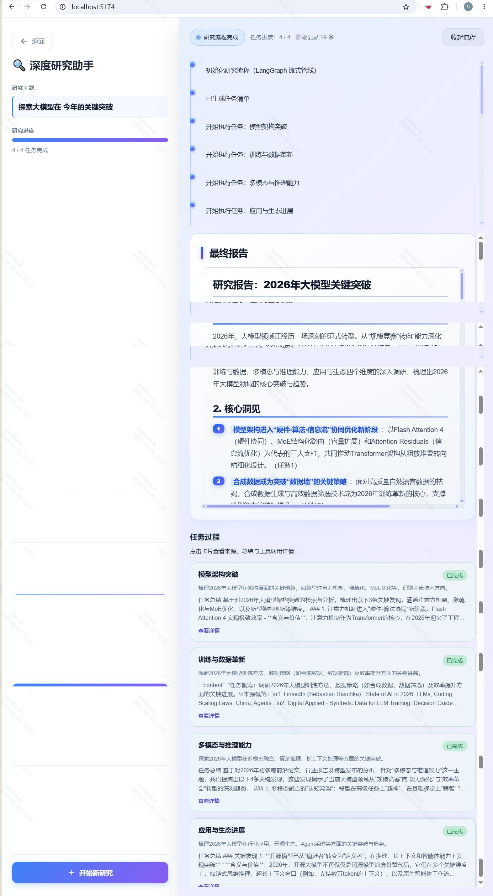

# AIDeepresearch · 深度研究助手

> 输入研究主题，自动规划任务、检索网络、归纳洞见，并生成带引用的 Markdown 研究报告。

---

## 1. 产品定位

| 维度 | 说明 |
|------|------|
| **一句话** | 面向调研、学习、写稿场景的 AI 深度研究工作台 |
| **核心能力** | 多轮检索 + 任务拆解 + 流式进度 + 结构化报告 |
| **差异化** | 过程可观测（时间线、子任务卡片、来源与笔记），结果可复核 |

---

## 2. 目标用户与场景

| 用户 | 典型场景 |
|------|----------|
| 产品 / 运营 | 行业扫描、竞品与趋势简报 |
| 研发 / 算法 | 技术主题文献与开源动态汇总 |
| 内容创作者 | 长文选题前的资料收集与提纲 |
| 学生 / 研究者 | 课程或课题的背景调研 |

**痛点**：手工搜索碎片化、难以并行多子题、缺少可引用的成稿结构。  
**价值**：一次输入主题，自动拆成 3～5 个互补子任务并行推进，最终输出可阅读的 Markdown 报告。

---

## 3. 用户旅程



1. **发起研究**：填写主题，可选覆盖搜索引擎（默认沿用后端 `.env`）。
2. **自动规划**：LLM 将主题拆解为若干互补子任务（通常 3～5 项）。
3. **并行执行**：各子任务独立检索、总结，前端通过 SSE 实时展示进度。
4. **交付报告**：汇总为带章节结构的 Markdown；可展开时间线、点击任务卡片查看来源与工具调用。

---

## 4. 功能清单

| 模块 | 功能 | 用户可见结果 |
|------|------|----------------|
| 研究规划 | 主题 → 待办任务清单 | 左侧进度条、任务卡片列表 |
| 智能检索 | Tavily / DuckDuckGo 等 | 每条任务附来源摘要 |
| 流式反馈 | SSE 推送状态与片段 | 顶部时间线、进行中/已完成状态 |
| 报告生成 | 多任务归纳 → 最终稿 | 「最终报告」区块（支持 GFM 渲染） |
| 任务详情 | 单任务来源、笔记、工具调用 | 弹层查看详情 |
| 笔记（可选） | 本地 Markdown 持久化 | `backend/notes/` |

---

## 5. 界面预览

> 截图目录：`asserts/`。README 使用压缩预览图以兼容编辑器预览；原图见 `search.png`、`result.png`。

### 5.1 研究入口

输入主题、选择搜索引擎，一键开始研究。



### 5.2 研究过程与报告

左侧展示主题与整体进度；右侧为流程时间线、最终报告与子任务卡片（可查看详情与来源）。



---

## 6. 系统架构（概要）

```
用户浏览器 (Vue 3)
        │  HTTP / SSE
        ▼
FastAPI (main.py)
        │
        ▼
DeepResearchAgent
  ├─ PlanningService     规划待办
  ├─ Search + Summarizer 检索与总结
  ├─ ReportingService    生成报告
  └─ LangGraph（同步路径） / 多线程流式路径
```

| 层级 | 技术选型 |
|------|----------|
| 前端 | Vue 3、TypeScript、Vite、marked + DOMPurify |
| 后端 | FastAPI、LangGraph、LangChain OpenAI |
| 大模型 | OpenAI 兼容 API（DeepSeek / 自定义网关 / 本地 Ollama） |
| 搜索 | Tavily、DuckDuckGo（`ddgs`）等，由 `SEARCH_API` 配置 |

---

## 7. 项目结构

```
AIDeepresearch/
├── asserts/           # 产品截图（README 引用）
├── backend/
│   ├── src/           # FastAPI、Agent、服务与 LangGraph
│   ├── notes/         # 可选本地笔记
│   ├── .env.example
│   └── pyproject.toml
└── frontend/          # Vue 3 单页应用
    └── .env.local     # VITE_API_BASE_URL 指向后端
```

---

## 8. 快速开始

### 8.1 环境要求

- Python **3.10+**
- Node.js **18+**（前端）
- 可访问的 **LLM API**；使用 Tavily 时需配置 `TAVILY_API_KEY`

### 8.2 配置后端

```bash
cd backend
cp .env.example .env
```

编辑 `.env`，至少配置：

```env
LLM_PROVIDER=custom
LLM_MODEL_ID=deepseek-chat
LLM_API_KEY=你的密钥
LLM_BASE_URL=https://api.deepseek.com/v1

SEARCH_API=tavily
TAVILY_API_KEY=你的_Tavily_密钥
```

> 若已设置 `LLM_BASE_URL` 与 `LLM_API_KEY` 但未写 `LLM_PROVIDER`，程序会自动按远程 API（`custom`）处理，避免误连本地 Ollama。

### 8.3 启动后端

```powershell
cd backend
$env:PYTHONPATH=".\src"   # Windows PowerShell；Linux/macOS: export PYTHONPATH=./src
python -m uvicorn main:app --reload --host 0.0.0.0 --port 8001
```

验证：浏览器打开 http://127.0.0.1:8001/healthz ，应返回 `{"status":"ok"}`。

### 8.4 启动前端

```bash
cd frontend
npm install
```

创建 `frontend/.env.local`（若尚未存在）：

```env
VITE_API_BASE_URL=http://127.0.0.1:8001
```

```bash
npm run dev
```

默认开发地址：**http://localhost:5174**（见 `frontend/vite.config.ts`）。

### 8.5 完成一次研究

1. 打开前端，输入研究主题，点击 **开始研究**。
2. 等待进度条与时间线更新。
3. 在 **最终报告** 阅读结果；点击子任务 **查看详情** 核对来源。

---

## 9. 配置说明

| 变量 | 说明 |
|------|------|
| `LLM_PROVIDER` | `custom`（远程 API）、`ollama`、`lmstudio` |
| `LLM_MODEL_ID` / `LLM_BASE_URL` / `LLM_API_KEY` | 模型与 OpenAI 兼容端点 |
| `SEARCH_API` | `tavily`、`duckduckgo`、`perplexity` 等 |
| `TAVILY_API_KEY` | 使用 Tavily 时必填 |
| `MAX_WEB_RESEARCH_LOOPS` | 单任务检索轮次上限（默认 3） |
| `FETCH_FULL_PAGE` | 是否拉取完整页面内容 |
| `PORT` | 后端端口（默认示例为 8001） |

完整示例见 [`backend/.env.example`](./backend/.env.example)。

---

## 10. API 概览

| 方法 | 路径 | 说明 |
|------|------|------|
| GET | `/healthz` | 健康检查 |
| POST | `/research` | 同步研究（返回报告 JSON） |
| POST | `/research/stream` | **推荐** SSE 流式研究 |
| GET | `/docs` | OpenAPI 交互文档 |

流式事件类型包括：`status`、`todo_list`、`task_status`、`task_summary_chunk`、`sources`、`final_report`、`done`、`error` 等。

---

## 11. 常见问题

| 现象 | 可能原因 | 处理 |
|------|----------|------|
| 前端报「研究失败」 | LLM 未配或仍走 Ollama | 确认 `.env` 中 `LLM_PROVIDER=custom` 与 `LLM_BASE_URL`（含 `/v1`） |
| 修改 `.env` 不生效 | 进程未重启 | 重启 uvicorn |
| 502 / 模型不存在 | 模型名或网关错误 | 改用服务商支持的 `LLM_MODEL_ID`（如 `deepseek-chat`） |
| 跨域错误 | 端口不一致 | `CORS_ORIGINS` 加入前端端口（如 5174） |

---

## 12. 版本与演进

- **当前**：LangGraph + LangChain 编排，已移除 `hello-agents` 依赖。
- **可规划**：历史研究列表、导出 PDF/Word、多语言报告、团队协作空间。

---

## 13. 许可证

MIT（见 `backend/pyproject.toml`）。
